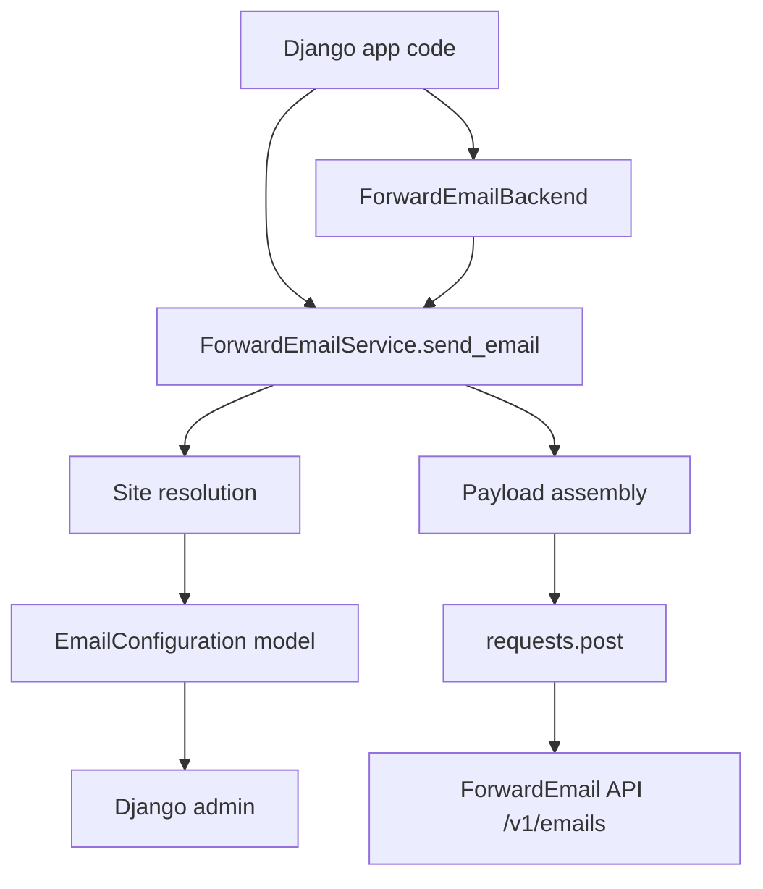
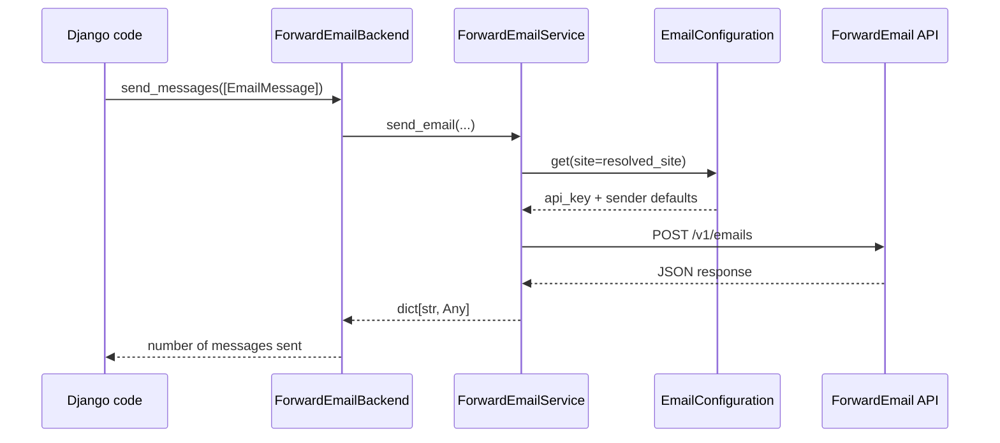

`django-forwardemail` is intentionally small. The package has one persistent model, one service class, one Django email backend, and optional admin wiring. The main data path is: resolve site -> load `EmailConfiguration` -> build JSON payload -> POST to ForwardEmail -> return JSON or raise an exception.



## Module Responsibilities

- `django_forwardemail/models.py` defines `EmailConfiguration`, which stores the API key and sender defaults per `Site`.
- `django_forwardemail/services.py` owns site detection, default merging, auth header generation, JSON payload assembly, logging, and HTTP delivery.
- `django_forwardemail/backends.py` adapts Django's `EmailMessage` and `EmailMultiAlternatives` objects to the service class.
- `django_forwardemail/admin.py` exposes configuration management in the Django admin with `select_related("site")` and a domain-ordered site selector.
- `django_forwardemail/apps.py` registers the app via `DjangoForwardEmailConfig`.

## Key Design Decisions

### Database-backed configuration instead of settings-based secrets

The package stores credentials in `EmailConfiguration` rather than a `FORWARD_EMAIL_API_KEY` setting. That choice is visible in `django_forwardemail/models.py`, where the only required operational inputs are model fields: `api_key`, `from_email`, `from_name`, `reply_to`, and `site`. The service then queries `EmailConfiguration.objects.get(site=site)` in `django_forwardemail/services.py` instead of reading a secret from Django settings. That design makes per-site credentials possible without branching application code.

### Service-first architecture

The backend is thin on purpose. In `django_forwardemail/backends.py`, `ForwardEmailBackend._send()` extracts values from the Django message object and immediately delegates to `ForwardEmailService.send_email()`. This avoids duplicating the site resolution and HTTP logic in two places. It also means your application can bypass Django's email helpers and call the service directly for jobs, webhooks, and custom workflows.

### Conservative site resolution

The service resolves the site in a strict order: explicit `site`, `request`, `Site.objects.get_current()`, then `Site.objects.first()`. This behavior is encoded in `django_forwardemail/services.py`, and the fallback is regression-tested in `tests/test_backend.py`. The implementation favors "keep working with a default site if one exists" over "require every caller to provide site context". That reduces boilerplate, but it also means multi-site apps should be deliberate about passing `site` or `request`.

### One-recipient-at-a-time backend delivery

`ForwardEmailBackend._send()` explicitly uses `email_message.to[0]` and comments that the ForwardEmail API sends to one recipient at a time. That means a Django message with multiple `to` recipients will only send the first address through this backend unless your application loops and creates one message per recipient. The constraint is documented in code, not hidden behavior, and it shapes how you should batch sends in production.

## Request Lifecycle



## How the Pieces Fit Together

The model is the center of configuration, but the service is the center of execution. A typical path starts in view code, a Celery task, or Django's built-in `send_mail()`. If you call `send_mail()`, Django instantiates `ForwardEmailBackend`, which converts the message object into primitive strings and forwards the call. If you call `ForwardEmailService.send_email()` directly, you skip that adapter layer and provide the primitives yourself.

Inside the service, the first decision is site selection. If you pass `request`, the code calls `get_current_site(request)` and rejects `RequestSite` values that are not real `Site` rows. If you pass neither `request` nor `site`, it tries `Site.objects.get_current()` and then the first site in the database. Once it has a site, the service loads the matching configuration, derives `from_email` and `reply_to` defaults, sanitizes the reply-to address, and then assembles the API payload:

```python
data = {
    "from": from_email,
    "to": to,
    "subject": subject,
    "text": text,
    "replyTo": reply_to,
}
```

If `html` is present, it adds `data["html"] = html`. It then constructs a Basic auth header using the API key as the username and an empty password, posts JSON to `{base_url}/v1/emails`, and returns `response.json()` only when the status code is exactly `200`.

## Operational Implications

- Your deployment must include `django.contrib.sites`; without it, the package cannot map requests or defaults to a configuration row.
- Missing `EmailConfiguration` rows fail fast with `ImproperlyConfigured`, which is the correct failure mode for configuration drift.
- `FORWARD_EMAIL_BASE_URL` only changes the API host. It does not replace the requirement for a database row containing the API key.
- `DEBUG=True` enables extra request and response logging under the `django_forwardemail` logger, which is useful in staging and dangerous in production if logs expose too much detail.

<Cards>
  <Card title="Email Configuration" href="/docs/email-configuration">Start with the data model that drives every send.</Card>
  <Card title="Site Resolution" href="/docs/site-resolution">See exactly how the package decides which configuration to use.</Card>
  <Card title="Delivery Pipeline" href="/docs/email-delivery-pipeline">Follow sender normalization, payload creation, and backend adaptation.</Card>
</Cards>
