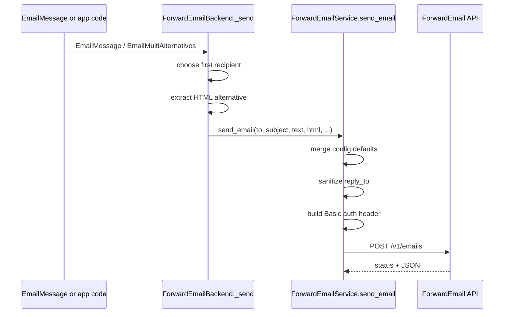

The delivery pipeline is the package's execution concept. It covers sender normalization, payload construction, optional HTML handling, Basic auth generation, and backend adaptation from Django email objects.

## What It Is

There are two entry paths into the same delivery logic:

- Direct path: `django_forwardemail.services.ForwardEmailService.send_email`
- Django backend path: `django_forwardemail.backends.ForwardEmailBackend.send_messages`

Both end up using the same service method, which is why understanding the service gives you the behavior of both APIs.

## Why It Exists

Django applications need two different interfaces:

- A low-level API for tasks, service layers, and custom workflows.
- A drop-in backend that works with `send_mail()`, `EmailMessage`, and `EmailMultiAlternatives`.

Instead of maintaining two independent implementations, the package keeps one canonical send path in `django_forwardemail/services.py` and a thin adapter in `django_forwardemail/backends.py`.

## Internal Flow



## How It Relates to Other Concepts

- `EmailConfiguration` provides API key and sender defaults.
- Site resolution picks the configuration row before delivery starts.
- The backend integration guide uses the same pipeline, but through Django's email APIs.

## How It Works Internally

### Sender normalization in the service

If `from_email` is omitted, the service constructs `"From Name <from@email.com>"` from the configuration row. If `from_email` is present but contains only an address, the service prepends the configured display name. That logic is implemented directly in `django_forwardemail/services.py`:

```python
if not from_email:
    from_email = f"{email_config.from_name} <{email_config.from_email}>"
elif "<" not in from_email:
    from_email = f"{email_config.from_name} <{from_email}>"
```

### Reply-to sanitation

The service calls Django's `sanitize_address(reply_to, "utf-8")` before sending. That keeps the reply-to header normalized and aligned with Django's email handling behavior.

### HTML handling in the backend

`ForwardEmailBackend._send()` inspects `EmailMultiAlternatives.alternatives` and uses the first `text/html` alternative it finds. It leaves the plain-text body in `email_message.body` and forwards both strings to the service. If you attach multiple HTML alternatives, only the first `text/html` one is used.

### One recipient per message

The backend intentionally uses `email_message.to[0]`. This is not an accident; the code comment explains the ForwardEmail API sends to one recipient at a time. If you have three recipients, create three messages or loop through addresses yourself.

## Basic Usage

Direct service call:

```python
from django_forwardemail.services import ForwardEmailService

ForwardEmailService.send_email(
    to="user@example.com",
    subject="Password changed",
    text="Your password was changed successfully.",
)
```

Backend usage with HTML:

```python
from django.core.mail import EmailMultiAlternatives

message = EmailMultiAlternatives(
    subject="Welcome",
    body="Welcome to Example.",
    from_email="noreply@example.com",
    to=["user@example.com"],
)
message.attach_alternative("<h1>Welcome to Example.</h1>", "text/html")
message.send()
```

## Advanced Usage

This pattern handles per-recipient fan-out explicitly so you do not lose recipients behind `to[0]`:

```python
from django.core.mail import EmailMessage, get_connection

connection = get_connection(
    backend="django_forwardemail.backends.ForwardEmailBackend",
    fail_silently=False,
)

recipients = ["a@example.com", "b@example.com", "c@example.com"]

for address in recipients:
    message = EmailMessage(
        subject="System notice",
        body="A deployment completed successfully.",
        from_email="ops@example.com",
        to=[address],
        connection=connection,
    )
    message.send()
```

<Callout type="warn">Do not assume a single `EmailMessage` with multiple `to` addresses will notify every recipient. The backend only uses the first address, so multi-recipient fan-out must happen in your application code.</Callout>

<Accordions>
<Accordion title="Why the backend delegates instead of posting directly">
Keeping HTTP logic inside `ForwardEmailService.send_email()` removes duplication and makes behavior identical whether you call Django's email helpers or the service class directly. This also centralizes logging, base URL overrides, and error handling in one place. The trade-off is that the backend exposes fewer extension points of its own because it is intentionally not the smart layer. If you need custom payload rules, wrapping or subclassing the service is the cleaner place to do it.
</Accordion>
<Accordion title="Returning raw API JSON versus a typed result object">
The service returns `dict[str, Any]` directly from `response.json()` because the package does not define its own response model. That keeps the implementation small and avoids freezing the ForwardEmail response shape into a local abstraction that might drift. The trade-off is weaker discoverability in application code, since you need to know what keys the upstream API returns. If your project needs a stable domain-specific contract, add your own wrapper that validates and transforms the response.
</Accordion>
</Accordions>

## Failure Modes

- Non-200 HTTP responses raise a generic `Exception` with the status code and response text.
- `requests.RequestException` is caught and wrapped as `Exception("Failed to send email: ...")`.
- When `fail_silently=True`, the backend suppresses send failures and excludes failed messages from the returned count.

The exact signatures and parameters are documented in the [API Reference](/docs/api-reference/services).
